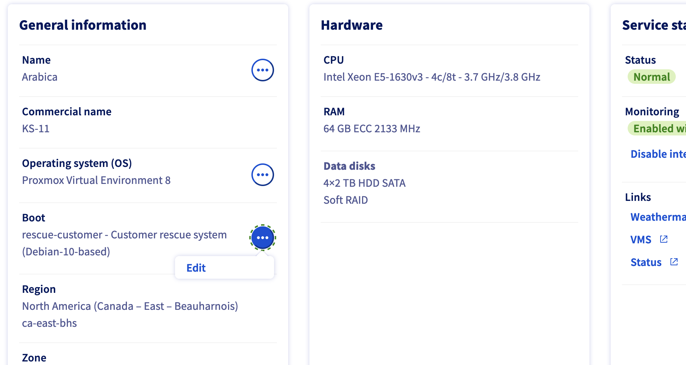

# Location

In most cases, I suggest you to host your services at home. It's cheaper and you have more control over your data. However, if you don't have a good internet connection or you don't want to deal with the noise and heat of the servers, you can rent a server from a cloud provider.

I experimented with a few cloud providers and I found that [OVH](https://eco.ovhcloud.com/) is the best in terms of price and performance. They have a data center in multiple locations (Europe, North America, Asia) and provide many features like private network, Terraform support, and a good API.

*Keep in mind that I'm not affiliated with OVH and that we're in the case of a personal project.*

Let's see how to install our baremetal cluster on OVH.

*I didn't test vRack (private network between multiple servers) with OVH. If used it, please let me know how it went :smile:*.

## OVH Install Talos

OVH provides many ways to install an OS on your server (Templates, [Bring-your-own-image](https://help.ovhcloud.com/csm/en-dedicated-servers-bringyourownimage?id=kb_article_view&sysparm_article=KB0043281)) but I will use the Rescue Mode to install Talos.




After rebooting in Rescue Mode, you will receive an email with the credentials (or just the IP if you provided an SSH Key) to connect to the server. You can connect to the server using SSH.

Once connected, you can download the Talos image and install it on the server.

If you're using Omni, you can download the image with the following command:

```bash
omnictl download iso --arch amd64 --extensions zfs --talos-version v1.9.1 # ZFS is optional, but I use it to create a ZFS pool, see more in ./docs/zfs.md
```

Then, you can use `dd` to write the image to the system disk.
```bash
dd if=talos.iso of=/dev/sda bs=4M status=progress
26+1 records in
26+1 records out
112099328 bytes (112 MB, 107 MiB) copied, 1.50875 s, 74.3 MB/s
```

*For now, Talos doesn't handle RAID*.

After writing the image to the disk, you can reboot the server and boot on the disk.


You should have a Talos node running on your server !