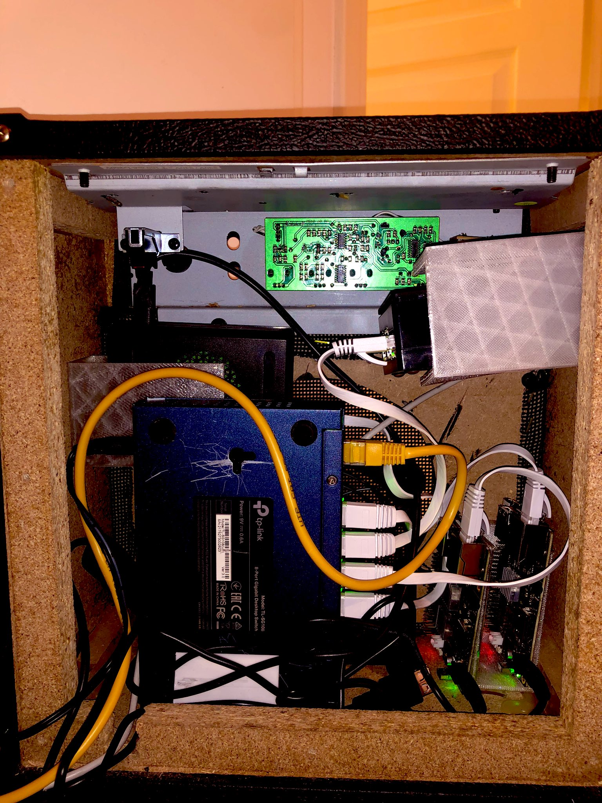
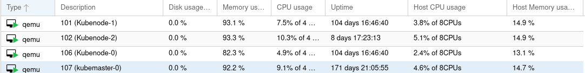

# GitOps

Bienvenue sur la documentation de mon projet GitOps me permettant de déployer mon infrastructure automatiquement.

# Matériel

## Maison

Je dispose d'un cluster Kubernetes composés de machines ARM *(pour la faible consommation d'énergie)*. Celui-ci est basé sur 4 noeuds :

| Nom               | Référence      | Mémoire vive | Taille disque |
|-------------------|----------------|--------------|---------------|
| jack-Rackham      | Rock64         | 4Go          | 16Go          |
| olivier-levasseur | Rock64         | 4Go          | 64Go          |
| la-buse           | Raspberry Pi 4 | 4Go          | 64Go          |
| mary-read         | Raspberry Pi 4 | 4Go          | 64Go          |

    

*C'est un petit peu le bordel, mais c'est compact. Il y a également un ventilateur derrière le commutateur.*

## Cloud

Sur mon hyperviseur Proxmox *(Chez OVH)*, j'ai installé mon Kubernetes à l'aide de Ansible / Terraform.

| Nom               | Mémoire vive | Taille disque |
|-------------------|----------------|-------------|
| Kubemaster-0      | 5Go            | 128Go       |
| Kubenode-1        | 5Go            | 128Go       |
| Kubenode-2        | 5Go            | 128Go       |
| Kubenode-3        | 5Go            | 128Go       |

    

