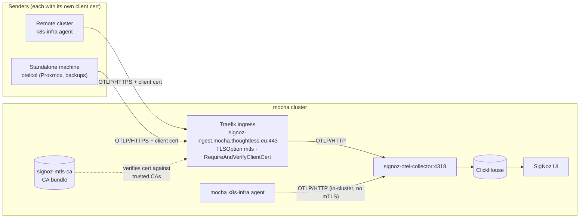

# SigNoz

SigNoz is the observability backend for the homelab. It stores metrics, logs and
traces, and it runs on the **mocha** cluster. Every cluster ships its telemetry to
this single instance over OpenTelemetry, and each one is tagged with its name so
the data can be told apart.

## Architecture

The core stack lives on mocha under `mocha/system/signoz/` and is deployed by the
`signoz` Helm chart. It bundles ClickHouse (storage), Zookeeper, an OpenTelemetry
collector and the web UI.

- The UI is exposed at `signoz.mocha.thoughtless.eu` through a Traefik ingress with
  a cert-manager certificate.
- ClickHouse persists its data on the `openebs-lvmpv` storage class.
- Telemetry is collected by the `k8s-infra` agent, one per cluster.

mocha collects its own telemetry through the in-cluster collector. Other clusters
push to an OTLP endpoint exposed over the internet and protected with mTLS.

## Telemetry collection

Each cluster runs the `k8s-infra` chart. It ships pod logs, host and kubelet
metrics, cluster metrics and Kubernetes events. The `global.clusterName` value sets
the `k8s.cluster.name` resource attribute on everything the agent sends, which is
how telemetry from each cluster is kept separate in the UI.

mocha talks to its collector in-cluster over plain HTTP:

```
otelCollectorEndpoint: http://signoz-otel-collector.signoz.svc.cluster.local:4318
```

The agent does not produce application traces on its own. To trace an application,
instrument it with an OpenTelemetry SDK and point it at the collector.

## Application metrics

Some applications ship their own metrics on top of what k8s-infra collects.

Traefik exports its metrics over OTLP (`metrics.otlp` in its Helm values). On mocha
it sends to the in-cluster collector; on other clusters it sends to the mTLS ingest
endpoint with a client certificate. Each Traefik tags its metrics with
`cluster=<name>` through `resourceAttributes`, which needs Traefik v3.5 or newer.

ArgoCD only exposes Prometheus metrics, so a Prometheus receiver added to the
k8s-infra deployment collector (`otelDeployment.config`) scrapes the ArgoCD metrics
services and forwards them, tagged with `cluster=mocha`.

The Traefik and ArgoCD dashboards both carry a `cluster` variable. `cluster` is a
resource attribute, so the dashboard filters reference it with an empty type
(`{"key":"cluster","type":""}`), not as a tag.

## Exposing SigNoz over the internet (mTLS)

The collector is exposed at `signoz-ingest.mocha.thoughtless.eu` through a Traefik
ingress (`otlp-ingress.yaml`). Traefik terminates TLS on 443 with a cert-manager
certificate and forwards OTLP/HTTP to the collector Service on port 4318. The
endpoint is protected with **mutual TLS**: a sender has to present a client
certificate signed by a CA that mocha trusts, otherwise the handshake is refused.

Any sender works the same way, whether it is a Kubernetes cluster or a standalone
machine — the only requirement is a client certificate from a trusted CA.



The trust and enforcement live in `otlp-mtls.yaml`:

- a `Secret` (`signoz-mtls-ca`) whose `tls.ca` key holds a **bundle of CA
  certificates concatenated in PEM** (one CA per sender),
- a Traefik `TLSOption` (`mtls`) set to `RequireAndVerifyClientCert` and pointing at
  that secret,
- the ingress selects the option with the annotation
  `traefik.ingress.kubernetes.io/router.tls.options: signoz-mtls@kubernetescrd`
  (Traefik reads a cross-namespace option as `<namespace>-<name>@kubernetescrd`).

Because the CA field is a bundle, adding a sender is purely additive: append its CA
public certificate to `tls.ca` and re-sync. No sender ever shares a key; each has
its own CA and client cert, so one can be revoked by dropping its CA from the
bundle. Current members: `signoz-mtls-ca`, `signoz-mtls-traefik-ca`,
`affogato-backup-ca`, `proxmox-ca`.

Inspect the bundle:

```
kubectl -n signoz get secret signoz-mtls-ca -o jsonpath='{.data.tls\.ca}' \
  | base64 -d | openssl storeutl -noout -text /dev/stdin | grep Subject:
```

## Trusting a new sender

The steps are the same for every sender; only how the client certificate is
produced and mounted differs (cluster vs. standalone machine, below).

1. **Produce a CA and a client certificate** for the sender. Keep the CA private
   key with the sender; only its public certificate is shared.
2. **Add the CA to mocha's trust bundle.** Append the CA public certificate (PEM) to
   the `tls.ca` field of the `signoz-mtls-ca` secret (`otlp-mtls.yaml`). The field is
   base64 of the concatenated PEM blocks, so append the new block and re-encode:

   ```
   { kubectl -n signoz get secret signoz-mtls-ca \
       -o jsonpath='{.data.tls\.ca}' | base64 -d; cat new-ca.crt; } \
     | base64 -w0
   ```

   Put that value back into `otlp-mtls.yaml` and let ArgoCD sync it.
3. **Point the sender at the endpoint** with its client cert and key:
   `https://signoz-ingest.mocha.thoughtless.eu` (OTLP/HTTP, 443).
4. Verify data arrives in the UI, filtered on the sender's identity (for clusters,
   `k8s.cluster.name`).

### Sender is a cluster

1. Deploy the `k8s-infra` chart and set `global.clusterName` — this tags everything
   with `k8s.cluster.name` so the cluster's data is told apart.
2. Let cert-manager issue a self-signed CA and a client certificate; it keeps both
   renewed and no private key touches the repo.
3. Mount the client certificate into the `k8s-infra` agent and point its exporter at
   the mounted files:

   ```
   exporters:
     otlphttp:
       endpoint: https://signoz-ingest.mocha.thoughtless.eu
       tls:
         cert_file: /mtls/tls.crt
         key_file: /mtls/tls.key
   ```

4. Add the cluster's CA to the trust bundle (step 2 above) and sync both clusters.

### Sender is a standalone machine (no Kubernetes)

Used by the Proxmox host and the backup jobs. There is no k8s-infra agent; run a
standalone OpenTelemetry Collector (or point an app's OTLP exporter) at the endpoint.

1. Generate a CA and a client certificate on the machine, e.g. with `openssl` or
   `step-cli`. Store the key locally (e.g. `/etc/otelcol/mtls/`), never in the repo.
2. Configure the collector's `otlphttp` exporter exactly as above, with
   `cert_file`/`key_file` pointing at the local paths and `endpoint`
   `https://signoz-ingest.mocha.thoughtless.eu`.
3. Set a `resource` processor to tag the source (e.g. `host.name`, or a custom
   attribute) so its telemetry is identifiable in the UI, since there is no
   `k8s.cluster.name`.
4. Add the machine's CA to the trust bundle (step 2 above) and sync mocha.

Quick check that the endpoint accepts the client cert:

```
curl -v https://signoz-ingest.mocha.thoughtless.eu/v1/metrics \
  --cert client.crt --key client.key -H 'Content-Type: application/json' -d '{}'
```

A TLS handshake that completes (even with an HTTP 4xx on the empty body) means the
certificate is trusted; a handshake failure means the CA is not in the bundle yet.

## Provisioning jobs (dashboards & alerts)

SigNoz stores dashboards, channels and alert rules in its own database, not in
Kubernetes objects — so they cannot be applied with `kubectl`. Instead, two Jobs
push them through the SigNoz REST API and keep the database in sync with the repo.
Both share the same shape:

- **ArgoCD PostSync hook** (`argocd.argoproj.io/hook: PostSync`), with
  `hook-delete-policy: BeforeHookCreation` — the previous run is deleted and a fresh
  one runs on **every sync**, so editing a dashboard or an alert and re-syncing
  re-applies it. `ttlSecondsAfterFinished: 600`, `backoffLimit: 3`.
- A minimal `python:3.12-alpine` container, non-root and `drop: [ALL]`, running an
  inline script (no external image to maintain).
- They call the in-cluster API at `http://signoz.signoz.svc.cluster.local:8080`
  with the header `SIGNOZ-API-KEY`. The key comes from the `signoz-api-key`
  ExternalSecret (Vault `kv/signoz#api_key`). Create it once in the UI under
  **Settings → API Keys** and store it in Vault.

Because they are PostSync hooks, they run *after* the chart is healthy, so the API
is up by the time they fire.

### Dashboard import job

`signoz-dashboard-import` (in `dashboard-provisioner.yaml`) mounts the
`signoz-dashboards` ConfigMap at `/dashboards` and **upserts by title**: it lists
existing dashboards, maps `title → id`, then for each JSON file `PUT`s by id if the
title already exists (falling back to `DELETE` + `POST` if the update is rejected),
or `POST`s a new one otherwise. It exits non-zero if any dashboard fails, which
**fails the ArgoCD sync** — a broken dashboard JSON is caught, not silently dropped.

The ConfigMap is built from `mocha/system/signoz/dashboards/*.json` by the
`configMapGenerator` in `kustomization.yaml`. To add a dashboard: drop its JSON in
that directory, add it to the generator, and sync (needs `ServerSideApply=true` once
the ConfigMap exceeds 256 KB).

### Alerting job

`signoz-alerting-provisioner` (in `alerting.yaml`) upserts the notification channel
and the alert rules. It also pulls the `discord-webhook` ExternalSecret (Vault
`kv/discord#webhook`, with the `/slack` suffix already included).

Alerts go to Discord. SigNoz has no native Discord support, but Discord accepts
Slack-formatted payloads on the `/slack` suffix of a webhook URL, so the job
provisions a **Slack channel** named `discord` pointing at `<webhook>/slack`
(`GET /api/v1/channels` → `PUT` by id if it exists, else `POST`). The channel's
`text` template renders one compact line per firing alert; keep it short, since
Discord rejects payloads over 4096 characters with an HTTP 400.

Alert rules use the SigNoz **v5** rule schema (`queries` with a `spec` and a
`filter.expression`) and each sets `preferredChannels: ["discord"]`. They are
upserted by title on every sync.

To add an alert, append a rule object to the job's script and re-sync, or create it
in the UI and pick the `discord` channel. To test the channel, use the "Test" button
in the UI or `POST /api/v1/testChannel`.
