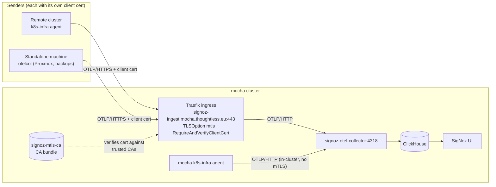

# SigNoz

SigNoz is the observability backend for the homelab. It stores metrics, logs and
traces, and it runs on the **mocha** cluster. Every cluster ships its telemetry to
this single instance over OpenTelemetry, and each one is tagged with its name so
the data can be told apart.

## Architecture

The core stack lives on mocha under `mocha/system/signoz/` and is deployed by the
`signoz` Helm chart. It bundles ClickHouse (storage), Zookeeper, an OpenTelemetry
collector and the web UI.

- The UI is exposed at `signoz.mocha.thoughtless.eu` through a Traefik ingress with
  a cert-manager certificate.
- ClickHouse persists its data on the `openebs-lvmpv` storage class.
- Telemetry is collected by the `k8s-infra` agent, one per cluster.

mocha collects its own telemetry through the in-cluster collector. Other clusters
push to an OTLP endpoint exposed over the internet and protected with mTLS.

## Telemetry collection

Each cluster runs the `k8s-infra` chart. It ships pod logs, host and kubelet
metrics, cluster metrics and Kubernetes events. The `global.clusterName` value sets
the `k8s.cluster.name` resource attribute on everything the agent sends, which is
how telemetry from each cluster is kept separate in the UI.

mocha talks to its collector in-cluster over plain HTTP:

```
otelCollectorEndpoint: http://signoz-otel-collector.signoz.svc.cluster.local:4318
```

The agent does not produce application traces on its own. To trace an application,
instrument it with an OpenTelemetry SDK and point it at the collector.

## Application metrics

Some applications ship their own metrics on top of what k8s-infra collects.

Traefik exports its metrics over OTLP (`metrics.otlp` in its Helm values). On mocha
it sends to the in-cluster collector; on other clusters it sends to the mTLS ingest
endpoint with a client certificate. Each Traefik tags its metrics with
`cluster=<name>` through `resourceAttributes`, which needs Traefik v3.5 or newer.

ArgoCD only exposes Prometheus metrics, so a Prometheus receiver added to the
k8s-infra deployment collector (`otelDeployment.config`) scrapes the ArgoCD metrics
services and forwards them, tagged with `cluster=mocha`.

external-secrets exposes Prometheus metrics on port 8080 but the chart ships its
ServiceMonitor disabled. `mocha/system/external-secret/external-secret.yaml` turns it
on with `serviceMonitor.enabled=true` plus `serviceMonitor.renderMode=alwaysRender` —
the chart's default `skipIfMissing` mode hides the ServiceMonitor behind a
`.Capabilities.APIVersions` check, which is unreliable under ArgoCD's templating even
though the CRD is installed. Enabling the ServiceMonitor also creates the metrics
Service it selects. The otel-metrics target allocator picks it up from there.

The metric worth watching is `externalsecret_status_condition`, labelled
`condition` / `status` / `namespace` / `name`: a broken ExternalSecret reports
`condition="Ready", status="False"` with value 1. The "ExternalSecret not ready"
alert fires on it. This matters because a failing ExternalSecret is otherwise
completely silent — the target Secret is simply never created and the workloads
consuming it sit in `CreateContainerConfigError` indefinitely (it went unnoticed for
four days on trmnl-server).

The Traefik and ArgoCD dashboards both carry a `cluster` variable. `cluster` is a
resource attribute, so the dashboard filters reference it with an empty type
(`{"key":"cluster","type":""}`), not as a tag.

## Exposing SigNoz over the internet (mTLS)

The collector is exposed at `signoz-ingest.mocha.thoughtless.eu` through a Traefik
ingress (`otlp-ingress.yaml`). Traefik terminates TLS on 443 with a cert-manager
certificate and forwards OTLP/HTTP to the collector Service on port 4318. The
endpoint is protected with **mutual TLS**: a sender has to present a client
certificate signed by a CA that mocha trusts, otherwise the handshake is refused.

Any sender works the same way, whether it is a Kubernetes cluster or a standalone
machine — the only requirement is a client certificate from a trusted CA.


```mermaid
flowchart LR
    subgraph senders["Senders (each with its own client cert)"]
        remote["Remote cluster<br/>k8s-infra agent"]
        machine["Standalone machine<br/>otelcol (Proxmox, backups)"]
    end

    subgraph mocha["mocha cluster"]
        traefik["Traefik ingress<br/>signoz-ingest.mocha.thoughtless.eu:443<br/>TLSOption mtls · RequireAndVerifyClientCert"]
        ca[("signoz-mtls-ca<br/>CA bundle")]
        collector["signoz-otel-collector:4318"]
        local["mocha k8s-infra agent"]
        ch[("ClickHouse")]
        ui["SigNoz UI"]
    end

    remote -->|"OTLP/HTTPS + client cert"| traefik
    machine -->|"OTLP/HTTPS + client cert"| traefik
    ca -.->|"verifies cert against<br/>trusted CAs"| traefik
    traefik -->|"OTLP/HTTP"| collector
    local -->|"OTLP/HTTP (in-cluster, no mTLS)"| collector
    collector --> ch --> ui
```

The trust and enforcement live in `otlp-mtls.yaml`:

- a `Secret` (`signoz-mtls-ca`) whose `tls.ca` key holds a **bundle of CA
  certificates concatenated in PEM** (one CA per sender),
- a Traefik `TLSOption` (`mtls`) set to `RequireAndVerifyClientCert` and pointing at
  that secret,
- the ingress selects the option with the annotation
  `traefik.ingress.kubernetes.io/router.tls.options: signoz-mtls@kubernetescrd`
  (Traefik reads a cross-namespace option as `<namespace>-<name>@kubernetescrd`).

Because the CA field is a bundle, adding a sender is purely additive: append its CA
public certificate to `tls.ca` and re-sync. No sender ever shares a key; each has
its own CA and client cert, so one can be revoked by dropping its CA from the
bundle. Current members: `signoz-mtls-ca`, `signoz-mtls-traefik-ca`,
`affogato-backup-ca`, `proxmox-ca`.

Inspect the bundle:

```
kubectl -n signoz get secret signoz-mtls-ca -o jsonpath='{.data.tls\.ca}' \
  | base64 -d | openssl storeutl -noout -text /dev/stdin | grep Subject:
```

## Trusting a new sender

The steps are the same for every sender; only how the client certificate is
produced and mounted differs (cluster vs. standalone machine, below).

1. **Produce a CA and a client certificate** for the sender. Keep the CA private
   key with the sender; only its public certificate is shared.
2. **Add the CA to mocha's trust bundle.** Append the CA public certificate (PEM) to
   the `tls.ca` field of the `signoz-mtls-ca` secret (`otlp-mtls.yaml`). The field is
   base64 of the concatenated PEM blocks, so append the new block and re-encode:

   ```
   { kubectl -n signoz get secret signoz-mtls-ca \
       -o jsonpath='{.data.tls\.ca}' | base64 -d; cat new-ca.crt; } \
     | base64 -w0
   ```

   Put that value back into `otlp-mtls.yaml` and let ArgoCD sync it.
3. **Point the sender at the endpoint** with its client cert and key:
   `https://signoz-ingest.mocha.thoughtless.eu` (OTLP/HTTP, 443).
4. Verify data arrives in the UI, filtered on the sender's identity (for clusters,
   `k8s.cluster.name`).

### Sender is a cluster

1. Deploy the `k8s-infra` chart and set `global.clusterName` — this tags everything
   with `k8s.cluster.name` so the cluster's data is told apart.
2. Let cert-manager issue a self-signed CA and a client certificate; it keeps both
   renewed and no private key touches the repo.
3. Mount the client certificate into the `k8s-infra` agent and point its exporter at
   the mounted files:

   ```
   exporters:
     otlphttp:
       endpoint: https://signoz-ingest.mocha.thoughtless.eu
       tls:
         cert_file: /mtls/tls.crt
         key_file: /mtls/tls.key
   ```

4. Add the cluster's CA to the trust bundle (step 2 above) and sync both clusters.

### Sender is a standalone machine (no Kubernetes)

Used by the Proxmox host and the backup jobs. There is no k8s-infra agent; run a
standalone OpenTelemetry Collector (or point an app's OTLP exporter) at the endpoint.

1. Generate a CA and a client certificate on the machine, e.g. with `openssl` or
   `step-cli`. Store the key locally (e.g. `/etc/otelcol/mtls/`), never in the repo.
2. Configure the collector's `otlphttp` exporter exactly as above, with
   `cert_file`/`key_file` pointing at the local paths and `endpoint`
   `https://signoz-ingest.mocha.thoughtless.eu`.
3. Set a `resource` processor to tag the source (e.g. `host.name`, or a custom
   attribute) so its telemetry is identifiable in the UI, since there is no
   `k8s.cluster.name`.
4. Add the machine's CA to the trust bundle (step 2 above) and sync mocha.

Quick check that the endpoint accepts the client cert:

```
curl -v https://signoz-ingest.mocha.thoughtless.eu/v1/metrics \
  --cert client.crt --key client.key -H 'Content-Type: application/json' -d '{}'
```

A TLS handshake that completes (even with an HTTP 4xx on the empty body) means the
certificate is trusted; a handshake failure means the CA is not in the bundle yet.

## Provisioning dashboards and alerts (SigNoz Operator)

SigNoz stores dashboards, channels and alert rules in its own database, not in
Kubernetes objects. The **SigNoz Operator** bridges that gap: it reconciles custom
resources of group `resources.signoz.io/v1alpha1` against the SigNoz REST API, so
dashboards and alert rules are ordinary manifests that ArgoCD applies like anything
else. It replaced the two inline-Python provisioning Jobs.

Two ArgoCD applications:

- `sys-signoz-operator` (`mocha/system/signoz-operator/`) installs the
  `signoz-operator` Helm chart from `https://charts.signoz.io` into the
  `signoz-operator` namespace, together with its CRDs. `ServerSideApply=true` is
  mandatory: the `dashboards` CRD is ~95 KB and blows past the apply annotation
  limit otherwise.
- `sys-signoz-resources` (`mocha/system/signoz-resources/`) holds the resources
  themselves, all in the `signoz` namespace.

### ProviderConfig

`providerconfig.yaml` declares a namespaced `ProviderConfig` named `mocha` that
points every custom resource at `http://signoz.signoz.svc.cluster.local:8080` and
authenticates with the `SIGNOZ-API-KEY` header, read from the `signoz-api-key`
secret (ExternalSecret, Vault `kv/signoz#api_key`). Create the key once in the UI
under **Settings → API Keys** and store it in Vault; the operator resolves the
secret in the `ProviderConfig`'s own namespace.

Every `Dashboard` and `Rule` references it with `spec.providerConfigRef.name: mocha`
and carries `argocd.argoproj.io/sync-options: SkipDryRunOnMissingResource=true`, so
a first sync does not fail before the operator has installed the CRDs.

`spec.reclaimPolicy` defaults to `Delete`: removing a manifest deletes the object in
SigNoz. Set it to `Orphan` on anything that must survive its manifest.

### Dashboards

One `Dashboard` per file in `mocha/system/signoz-resources/dashboards/`. The body
sits under `spec.objectTemplate.spec` in the **typed** form rather than as a
`jsonSpec` string, so the Kubernetes API server validates the whole v6 schema at
apply time instead of letting SigNoz reject it later.

The body is the SigNoz **v6** dashboard schema (`schemaVersion: v6`): `panels` is a
dictionary keyed by panel id, and `layouts[].spec.items[].content.$ref` points into
it with `#/spec/panels/<id>`. The v1 keys (`widgets`, `layout`, `panelMap`, `uuid`,
`version`) no longer exist — the v1 API returns `501 dashboard_deprecated` since
SigNoz 0.135, which is why the old JSON dashboards had all silently stopped being
imported.

Things the CRD schema enforces that the raw API tolerated:

- `decimalPrecision` must be omitted (the CRD enum mixes integers and `full`, so no
  plain value validates) — SigNoz applies its own default.
- `temporality: ""` and `source: ""` are rejected; omit the field instead of
  sending an empty string.
- `softMin`, `softMax` and `customColors` must be omitted rather than set to
  `null`; `thresholds` is an empty array, not `null`.

And things only the **live API** rejects, discovered by probing it — the CRD schema
models one permissive union for every panel kind, so `kubectl apply` accepts shapes
that SigNoz then refuses. `plugin.spec` accepts a different set of keys per kind:

| Panel kind | accepted `plugin.spec` keys |
|---|---|
| `TimeSeriesPanel` | `visualization` (+`fillSpans`), `formatting`, `chartAppearance`, `axes`, `legend`, `thresholds` |
| `BarChartPanel` | `visualization` (+`fillSpans`), `formatting`, `axes`, `legend`, `thresholds` — **no** `chartAppearance` |
| `NumberPanel` | `visualization`, `formatting`, `thresholds` |
| `TablePanel` | `visualization`, `formatting` (**no** `unit`), `thresholds` |
| `PieChartPanel` | `visualization`, `formatting`, `legend` |
| `HistogramPanel` | `legend` only |
| `ListPanel` | nothing |

`visualization.fillSpans` is only valid on `TimeSeriesPanel` and `BarChartPanel`.

Two more live-only rules:

- A variable cannot set `allowAllValue: true` unless `allowMultiple` is also true
  (`allowAllValue cannot be set if allowMultiple is not set to true`). A v1 variable
  with `multiSelect: false` therefore loses its "ALL" option.
- `signoz/PromQLQuery` is accepted only on `TimeSeriesPanel`, `NumberPanel` and
  `BarChartPanel`. A PromQL table or pie chart is rejected with `query kind ... is
  not supported by panel kind ...`; use a bar chart instead.
  `signoz/ClickHouseSQL` works on every panel kind.

A panel takes **exactly one** entry in `queries`. To draw several series or a
formula, use a single query of kind `signoz/CompositeQuery` whose `spec.queries`
holds the sub-queries (`type: builder_query`) and the formula
(`type: builder_formula`, `spec.expression: "A/B"`). Raw panels use
`signoz/ClickHouseSQL` or `signoz/PromQLQuery` with `spec.query`.

Dashboard variables are `ListVariable` entries whose `spec.plugin.kind` is
`signoz/DynamicVariable` (`spec.name` + `spec.signal`), `signoz/QueryVariable` or
`signoz/CustomVariable` — the v1 shape with a UUID `id` is gone.

### Alert rules

One `Rule` per file in `mocha/system/signoz-resources/rules/`, using the
**v2alpha1** rule schema:

- `evaluation: {kind: rolling, spec: {evalWindow, frequency}}` replaces the
  top-level `evalWindow`/`frequency`.
- `condition.thresholds: {kind: basic, spec: [{name, op, matchType, target,
  channels}]}` replaces `condition.op`/`target`/`matchType` and
  `preferredChannels`. `op` is `above`/`below`/..., `matchType` is
  `at_least_once`/`all_the_times`/`on_average`/`in_total`/`last`.
- `notificationSettings` is required; `usePolicy: false` keeps routing on the
  threshold's `channels` instead of a `RoutePolicy`.
- `condition.alertOnAbsent` + `condition.absentFor` still drive no-data alerts
  (used by "Backup server not reporting").
- `groupBy` entries are `{name: <key>}`. They become alert labels, which is what
  the Discord template prints — keep them.

### Discord channel

The operator has no `Channel` kind, so the notification channel is still created by
a small PostSync Job (`discord-channel.yaml`) that upserts it through
`POST`/`PUT /api/v1/channels`. Discord has no native SigNoz support but accepts
Slack-formatted payloads on the `/slack` suffix of a webhook URL, so the channel is
a **Slack** channel named `discord` pointing at `<webhook>/slack` (Vault
`kv/discord#webhook`, suffix included). Keep the `text` template short: Discord
rejects payloads over 4096 characters with an HTTP 400. Test it with
`POST /api/v1/testChannel` (expects 204) or the "Test" button in the UI.

Ordering caveat: the Job is a PostSync hook, so on a brand-new SigNoz database the
alert rules are reconciled before the channel exists and may land in `Terminal`
with a "channel not found" message. A second sync of `sys-signoz-resources` fixes
it, since the channel is then already there.

### Day-to-day

Add a dashboard or an alert by dropping a manifest in the right directory and
listing it in `kustomization.yaml`. Check the result with:

```bash
kubectl -n signoz get dashboards,rules
```

`Ready=True` with an `ID` column means the object exists in SigNoz. `Ready=False`
carries the API's own error message in the conditions; reason `Terminal` means the
body was refused and no retry will help.
